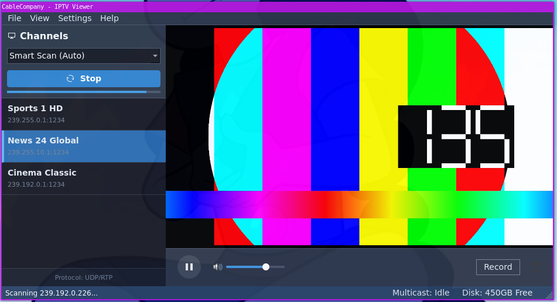

# CableCompany - IPTV Viewer

A Python-based desktop application for discovering and viewing UDP Multicast streams. Built with **PyQt5** and **LibVLC**, it features a modern dark UI, an embedded video player, and an intelligent network scanner that detects active MPEG-TS streams and extracts channel metadata (SDT) automatically.



## 🚀 Features

  * **Modern Dark UI:** A responsive, "Fusion" themed interface designed for desktop usage.
  * **Embedded Player:** Uses LibVLC to play low-latency UDP multicast streams directly within the application window.
  * **SDT Metadata Parsing:** Automatically extracts "Service Name" (Channel Name) and Provider info from raw MPEG-TS packets.
  * **Intelligent Network Scanning:**
      * **Smart Scan (Default):** Uses a "Beacon" heuristic to hop common IPTV subnets (e.g., `239.255.x.1`). If a signal is found, it automatically expands to scan the entire neighboring subnet.
      * **Custom Range:** Advanced users can define specific CIDR-style ranges (e.g., `239.100.0.*`).
  * **Cross-Platform:** Designed to work on Linux and Windows (with appropriate VLC backends).

## 📂 Project Structure

```text
.
├── assets/              # Stylesheets and visual assets
├── core/                # Core logic (Scanner, Packet Parsing)
├── ui/                  # PyQt5 Widgets (Sidebar, Player, Window)
├── test/                # Testing tools
│   └── streamer/        # Go-based multicast simulator
└── main.py              # Application Entry Point
```

## 🛠 Prerequisites

  * **Python 3.10+**
  * **VLC Media Player** must be installed on the system (LibVLC bindings require the actual binary).
      * *Linux (Debian/Ubuntu):* `sudo apt install vlc`
      * *Windows:* Install VLC 64-bit.

## 📦 Installation

1.  **Clone the repository**

    ```bash
    git clone https://github.com/yourusername/cablecompany.git
    cd CableCompany
    ```

2.  **Create a Virtual Environment**

    ```bash
    python3 -m venv .venv
    source .venv/bin/activate  # On Windows: .venv\Scripts\activate
    ```

3.  **Install Dependencies**

    ```bash
    pip install PyQt5 python-vlc
    ```

## ▶️ Usage

1.  **Run the Application**

    ```bash
    python main.py
    ```

2.  **Scanning for Channels**

      * On the sidebar, ensure **Smart Scan (Auto)** is selected.
      * Click **Start Scan**.
      * The app will scan common multicast beacons. If it detects a stream, it will populate the list with the channel name found in the stream metadata.

## 🧪 Testing with Simulated Streams

To test the application without a real IPTV network, a **Go-based Streamer** is included in the `test/` directory. This tool generates 3 simultaneous multicast streams on different subnets with distinct metadata, specifically designed to test the **Smart Scan** logic.

### 1\. Run the Streamer

You need Go installed to run the simulator.

```bash
cd test/streamer
go run main.go
```

This will launch 3 streams:

  * `239.255.0.1`: **Sports 1 HD** (Standard Block)
  * `239.255.10.1`: **News 24 Global** (Tests Subnet Hopping)
  * `239.192.0.1`: **Cinema Classic** (Tests Org-Local Block)

### 2\. Verify in App

With the Go streamer running, open the Python app and click **Start Scan**. It should automatically discover all three channels, proving that the scanner successfully hopped between subnets and parsed the custom metadata.

## 🔧 Technical Notes

  * **Multicast Routing:** If you are on a managed network, ensure your switch supports IGMP Snooping and that your firewall allows UDP traffic on the target ports (Default: 1234).
  * **Linux VLC Embedding:** The player uses `--avcodec-hw=none` and `--no-xlib` flags to ensure stability within the PyQt5 environment on Linux systems.